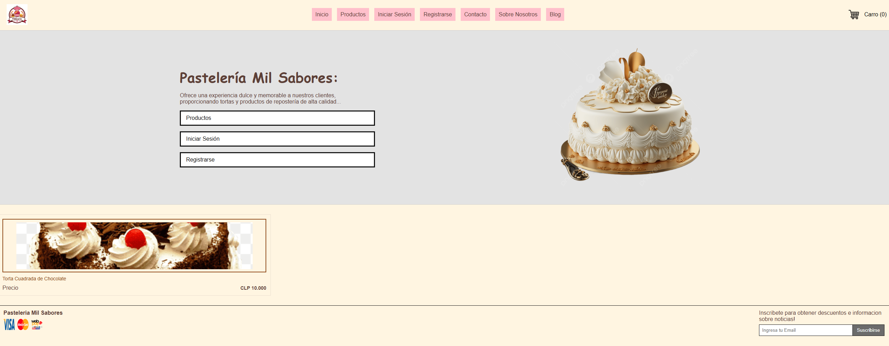
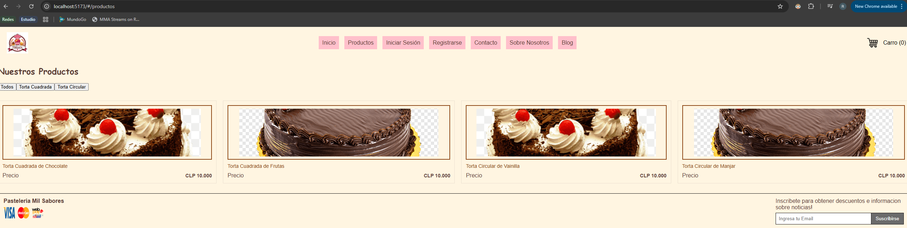
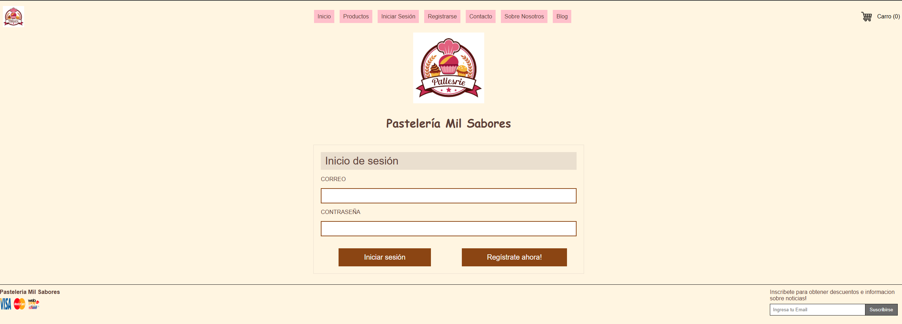
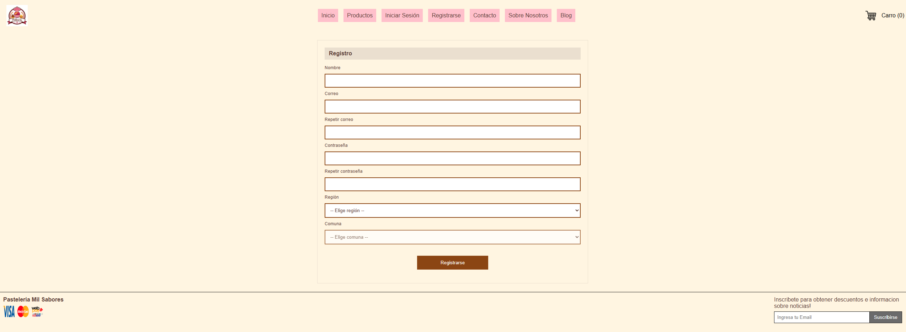

# Entrega 1

Se utilizo React + Vite como lo mostrado en clase y en el repositorio entregado por el profesor

# Descripcion de entrega

Se configuro el proyecto para mostrar las siguientes vistas: 

## Home

Se configuro el Home para mostrar la tienda, un Hero el cual contiene botones que llevan al inicio de sesion y registro, asi como tambien, una imagen y descripcion de los productos. Por otro lado, se muestra una vista de los productos.



## Productos

La pagina de productos se configuro para permitir mostrar pasteles, asi como tambien, filtros para categorizarlos, esta es una funcionalidad que esta en proceso de desarrollo



## Inicio de Sesion

Se configuro el inicio de sesion, el cual permite entrar con la credencial:

```
    const testEmail = "rparra@duoc.cl";
    const testPass = "123456";
```

Sin embargo, no se tiene aun una vista del panel adminsitrativo, es una funcionalidad demo.



## Registro

Se creo un registro que contiene validaciones basicas.



